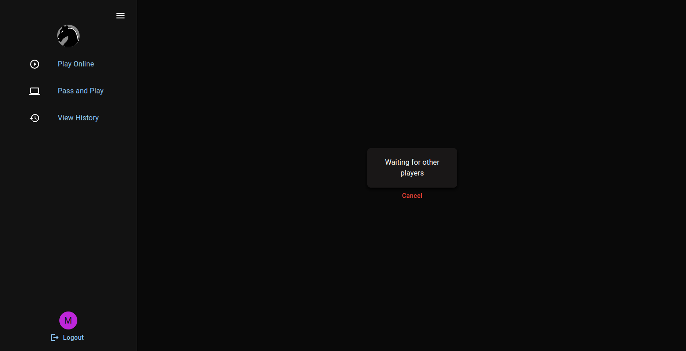
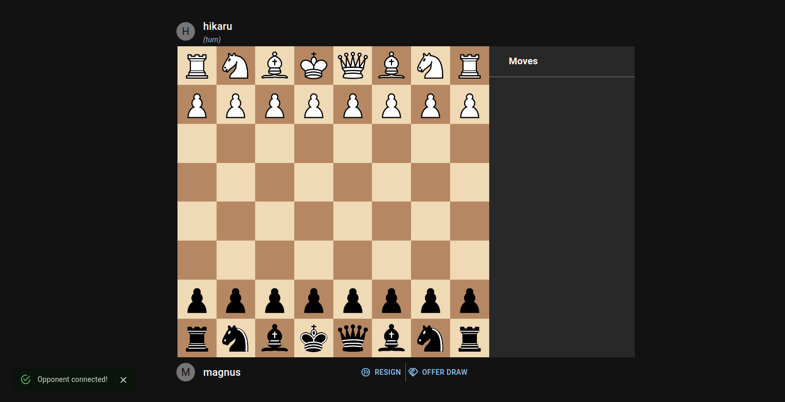
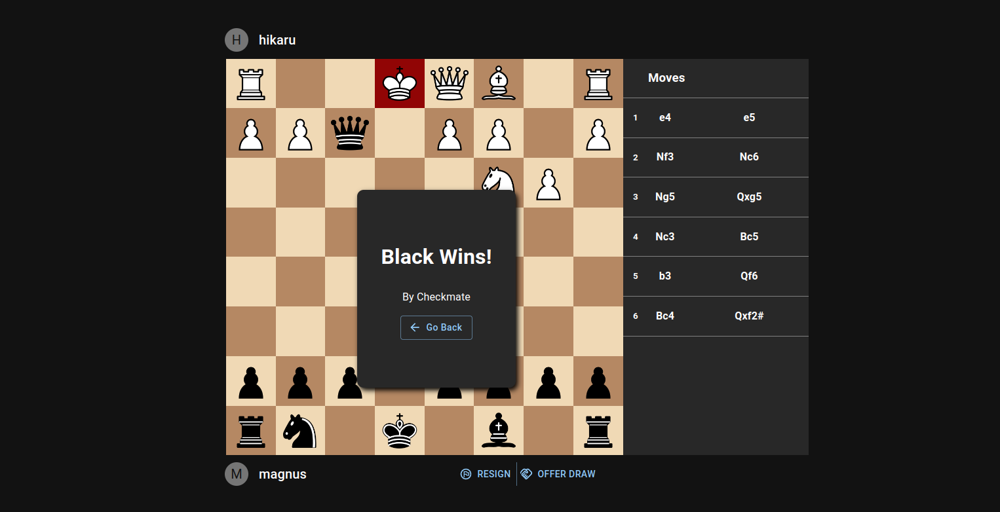
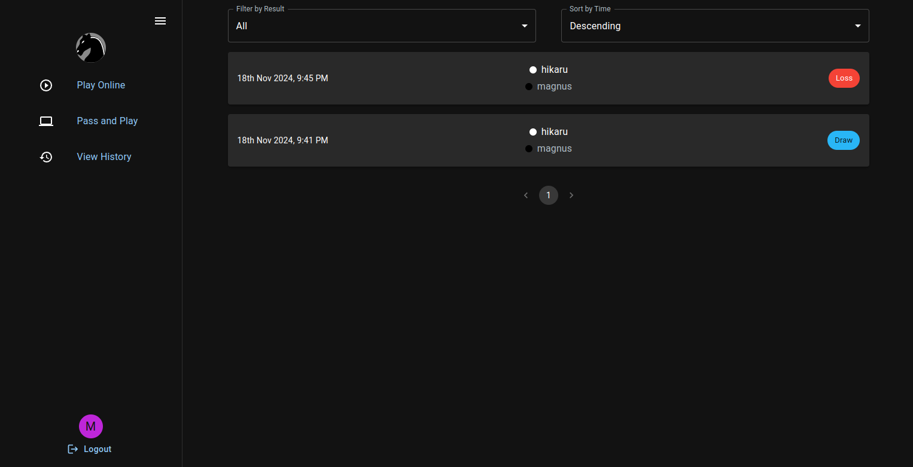
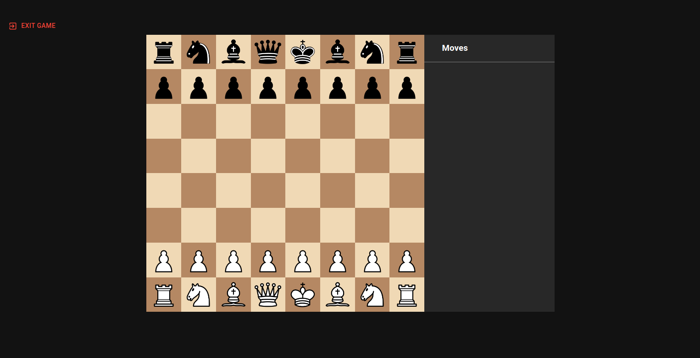

# Online Chess WebApp  

**URL**: [https://webchess.azurewebsites.net](https://webchess.azurewebsites.net)  
_Deployed on Microsoft Azure App Service._

## Overview  

The **Online Chess WebApp** is an application enabling players to:  
- Pair with others online and play chess in real-time.  
- Store and view game results in a personalized history section.  
- Use the "Pass and Play" feature for self-play or exploring chess positions.  

This application is designed for both logged-in users and anonymous players.  

---

## Features  
- **Online Gameplay**: Real-time chess matches with a seamless pairing system.  
- **Game History**: View stored results of completed matches.  
- **Pass and Play**: Play both sides of the board or explore game positions.  
- **Responsive Design**: Optimized for desktops and mobile devices.  

---

## Deployment  

This application is deployed using **Microsoft Azure App Service** as a multi-container setup with **Docker Compose**.  

### Architecture:  
1. **Frontend**: ReactJS app running in the `client` container.  
2. **Backend**: Node.js API running in the `api` container.  
3. **Database**: PostgreSQL using the official PostgreSQL container.  
4. **Session Management**: Redis using the official Redis container.  
5. **Reverse Proxy**: Nginx container routing requests to the client and API upstreams.

### Docker Compose Configuration  
The `docker-compose.yml` file defines the following containers:  
- `postgres`: Official PostgreSQL container.  
- `redis`: Official Redis container.  
- `api`: Node.js backend.  
- `client`: ReactJS frontend.  
- `nginx`: Nginx reverse proxy for routing requests.  

---

## Screenshots  
### 1. Pairing Screen
  
### 1. Online Game   
  

### 2. Game Result  
  

### 3. History Page   
  

### 4. Pass and Play  
  

---

## Getting Started  

To set up the application locally:  

1. Clone the repository:  
   ```bash
   git clone https://github.com/your-username/online-chess-webapp.git
   cd online-chess-webapp
   ```
2. Ensure Docker and Docker Compose are installed on your system.

3. Provide appropriate environment variables through the .env files wherever necessary.

3. Run the application:
    ```bash
    docker-compose up --build
    ```